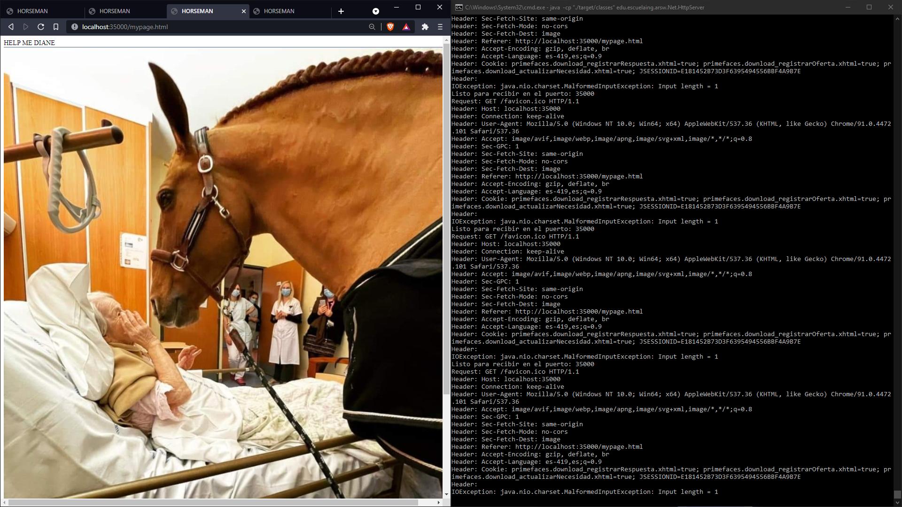
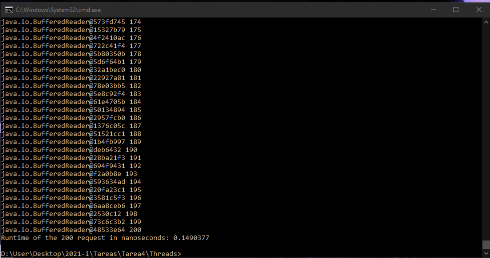
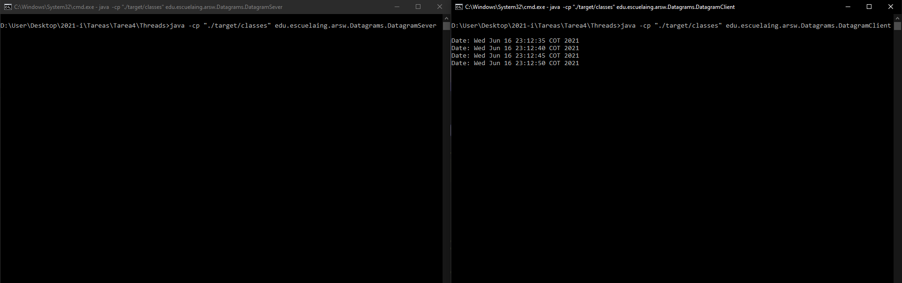

# Tarea #4
# Modificacion para Tarea 5 implementada
>## Autor
>>Lorenzo Maruqez
>## Fecha
>>16/06/2021
>## LOC/h
>> 283 Lineas, 31.1LOC/h 

# Pre-Requisitos
Tener java 1.8 y conocimiento del uso de consola 

# Servidor con Concurrencia
En este ejercicio se modifico el servidor de un ejercicio anterior para que reciba las respuesta de los clientes de forma concurrente en este caso la maneja con 30 hilos.
>
> - Para correr el servidor se usa `java -cp "./target/classes" edu.escuelaing.arsw.Net.HttpServer`
> - Si se quiere ver implementado en Heroku puede acceder a https://remotethreads.herokuapp.com/mypage.html

# Reporte de pruebas
En las pruebas el servidor mantiene un recurso el cual nos ayuda a verificar los hilos, en las pruebas se le manda a llamar este recurso esperando diferentes valores para los hilos y tambien se valida que de ser requerido se cierre el socket.
> 
>
>Tambien se realizo un cliente apate para validar la respuesta del servidor a multiples solicitudes contando con 200 hilos mostrando el tiempo en el que lo realiza
> 
> - cliente de prubas `java -cp "./target/classes" edu.escuelaing.arsw.Net.HttpClient`

# Datagramas
Los datagramas funciona con un servidor y un cliente, el servidor envia la hora al cliente cada 5 segundos y el cliente la imprime, si no recibe nuevos datos del server sige mostrando la ultima hora dada por el server hasta que tenga nueva informacion de este
> 
> Los comandos para ejecutar el server y el cliente del datagrama respectivamente:
> - java -cp "./target/classes" edu.escuelaing.arsw.Datagrams.DatagramSever
> - java -cp "./target/classes" edu.escuelaing.arsw.Datagrams.DatagramClient

# JavaDoc
> La documentacion puede ser encontrada en resources

# Licencia
Este proyecto esta bajo Licencia de uso libre https://github.com/DrLolo03/Threads/blob/main/LICENSE para mas informacion